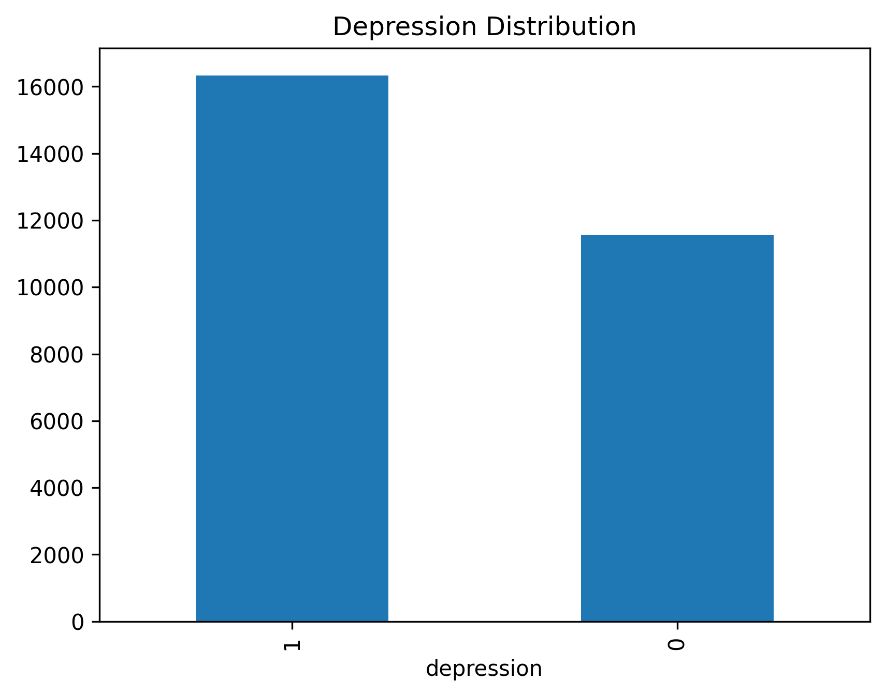
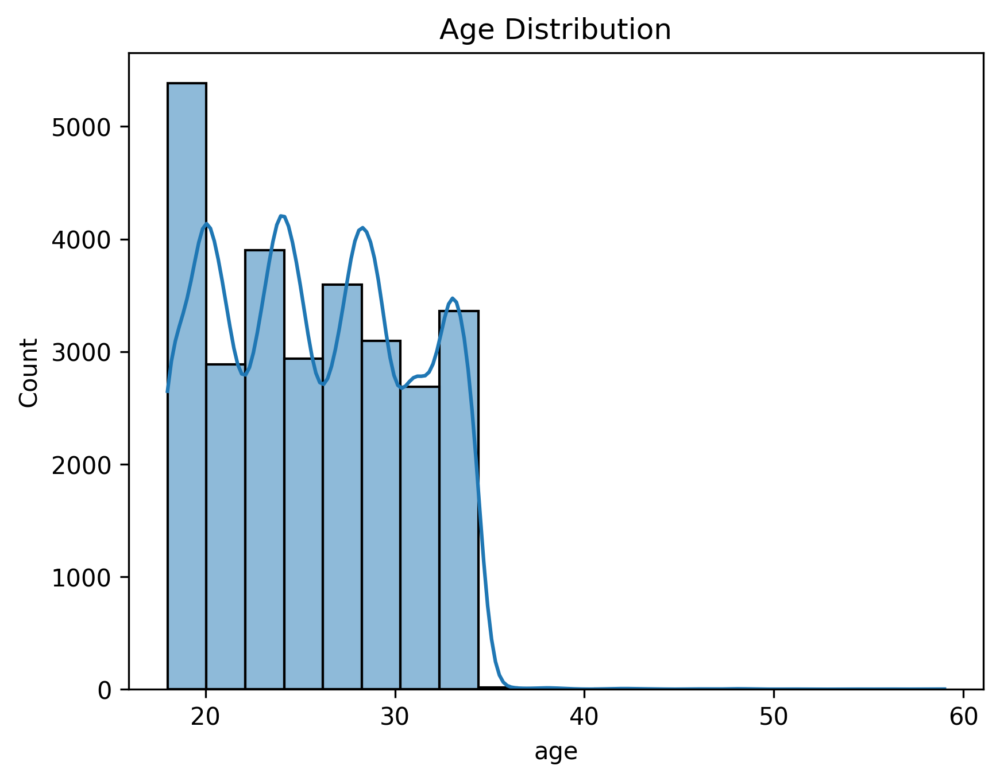
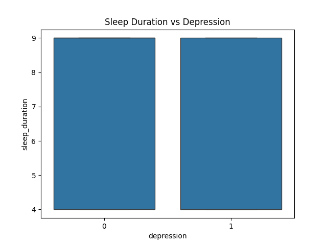
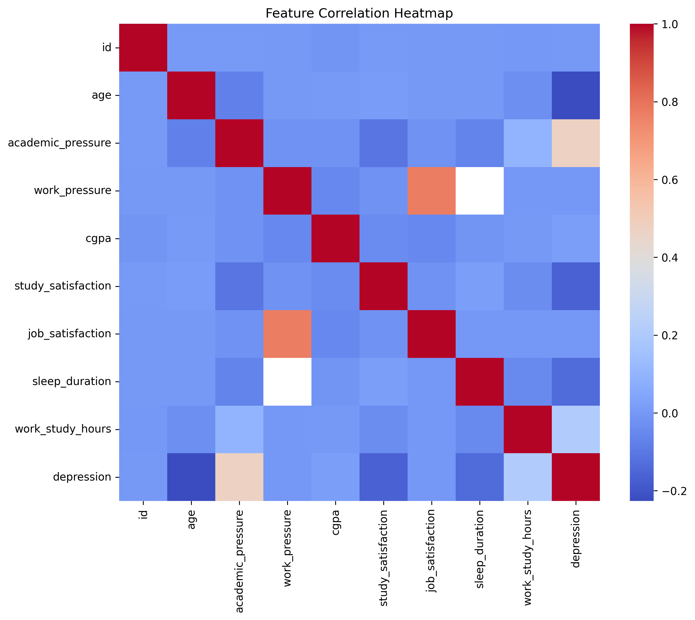

## Research Objective 

This project conducts a reproducible statistical investigation of behavioral and lifestyle factors associated with student depression.

Rather than focusing on predictive modeling, the study emphasizes:

Statistical significance testing

Effect size estimation

Behavioral interpretation of results

Research-grade visualization and documentation

The goal is to simulate the analytical workflow of a university research programmer supporting mental health studies.

---

## Research Questions

1. Is sleep duration significantly associated with depression status?
2. Do academic or financial stress levels correlate with higher depression risk?
3. Which behavioral factors show the strongest statistical relationship with depression?

---

## EDA includes:

- Dataset integrity checks and column normalization
- Distribution analysis of demographic and behavioral variables
- Visualization of depression prevalence across factors
- Correlation analysis among numeric features

All visual outputs are saved for reproducible research reporting.

---

## Exploratory Data Analysis Results

The following visualizations summarize key behavioral and lifestyle
patterns associated with student depression.

### Depression Distribution

This chart shows the prevalence of depression within the dataset,
providing a baseline understanding of class balance for further analysis.

---

### Age Distribution

The histogram illustrates the demographic age structure of the student
population, which may influence mental health risk patterns.

---

### Sleep Duration vs Depression

This visualization explores whether reduced sleep duration is associated
with higher depression prevalence, a commonly reported psychological factor.

---

### Feature Correlation Heatmap

The heatmap highlights statistical relationships among numeric variables,
helping identify potential predictors and confounding factors related to depression.
